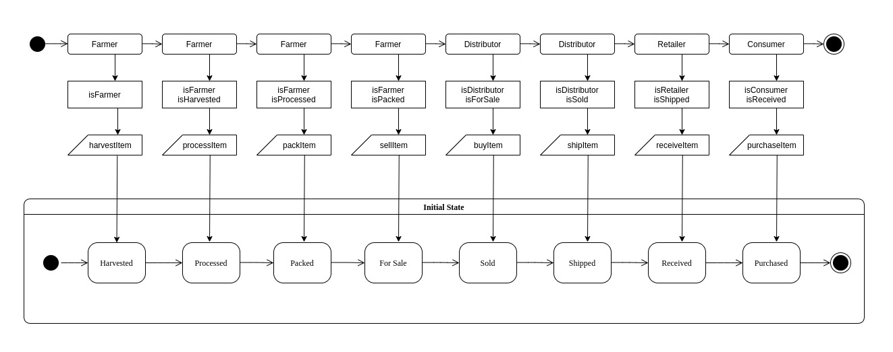
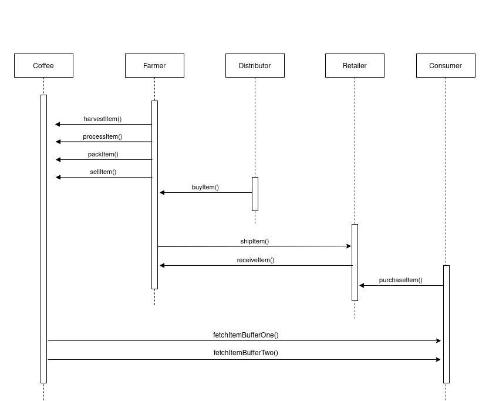
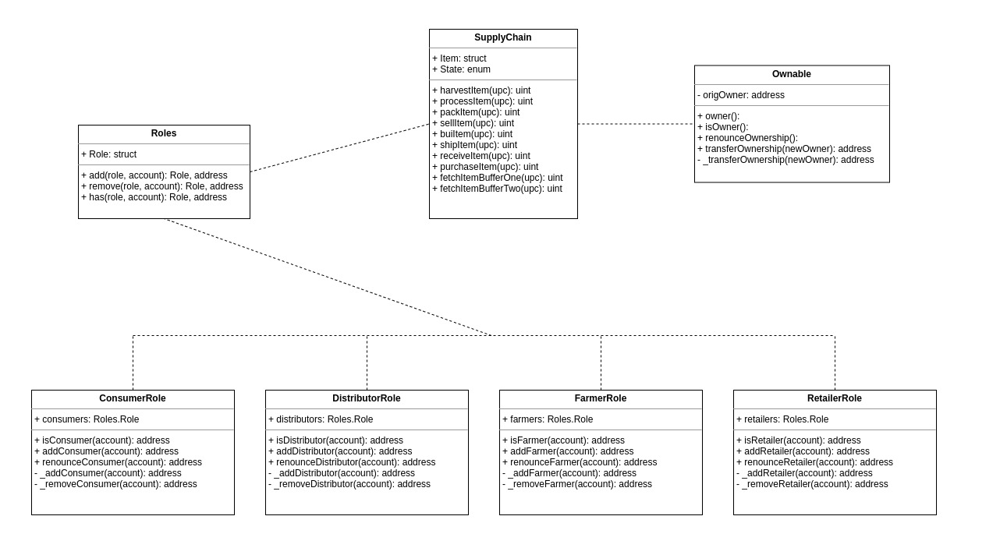
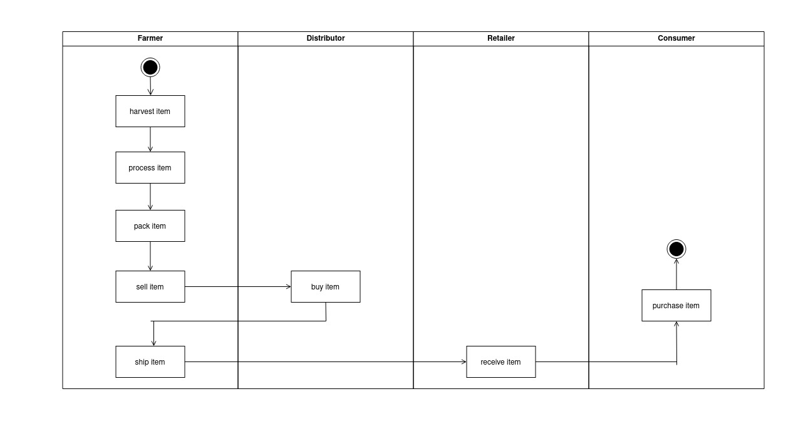

# Supply chain & data auditing
## Introduction
This repository contains an Ethereum DApp that demonstrates a Supply Chain flow between a Seller and Buyer of a Coffee product. The user story is similar to any commonly used supply chain process. A Seller can add items to the inventory system stored in the blockchain. A Buyer can purchase such items from the inventory system. Additionally a Seller can mark an item as Shipped, and similarly a Buyer can mark an item as Received.


## UML Diagrams
### State Diagram


### Sequence Diagram


### Class Diagram


### Activity Diagram


## Getting Started

These instructions will get you a copy of the project up and running on your local machine for development and testing purposes. See deployment for notes on how to deploy the project on a live system.

### Prerequisites

Please make sure you've already installed the following dependencies:
* Ganache-cli: uses ethereumjs to simulate full client behavior and make developing Ethereum applications faster, easier, and safer.
* Truffle: the the most popular dev framework for Ethereum 
* MetaMask extension in your browser: for interacting with the blockchain


### Installing

A step by step series of examples that tell you have to get a development env running

Clone this repository:

```
git clone https://github.com/seaona/supply-chain-auditing-ethereum
```

Change directory to ```project-6``` folder and install all requisite npm packages (as listed in ```package.json```):

```
cd project-6
npm install
```

Launch Ganache:

```
ganache-cli -m "spirit supply whale amount human item harsh scare congress discover talent hamster"
```

Your terminal should look something like this:


In a separate terminal window, Compile smart contracts:

```
truffle compile
```

Your terminal should look something like this:


This will create the smart contract artifacts in folder ```build\contracts```.

Migrate smart contracts to the locally running blockchain, ganache-cli:

```
truffle migrate
```

Your terminal should look something like this:


Test smart contracts:

```
truffle test
```

All 10 tests should pass.


In a separate terminal window, launch the DApp:

```
npm run dev
```
The DApp User Interface when running should look like...


## Built With

* [Ethereum](https://www.ethereum.org/) - Ethereum is a decentralized platform that runs smart contracts
* [Truffle Framework](http://truffleframework.com/) - Truffle is the most popular development framework for Ethereum with a mission to make your life a whole lot easier.


## Deployment
* Deployment has been done on Rinkeby testnet running `truffle migrate --reset --network rinkeby`

* Contract address: [0xfb1a92921D625FB74BC6b19C9AF0457c8502e961](https://rinkeby.etherscan.io/address/0xfb1a92921D625FB74BC6b19C9AF0457c8502e961#code)

* Transaction hash: [0x15012a581b84550c2ff948873159b9843f709a3e59e84fe3c67973d8996ca910](https://rinkeby.etherscan.io/tx/0x15012a581b84550c2ff948873159b9843f709a3e59e84fe3c67973d8996ca910)

* Contract is verified using truffle-plugin-verify as a dev dependency, and configuring the plugin on truffle-config.js.

* For verifying the contract run: `truffle run verify SupplyChain --network rinkeby`

* For interacting with the contract, you can use directly EtherScan as follows:

